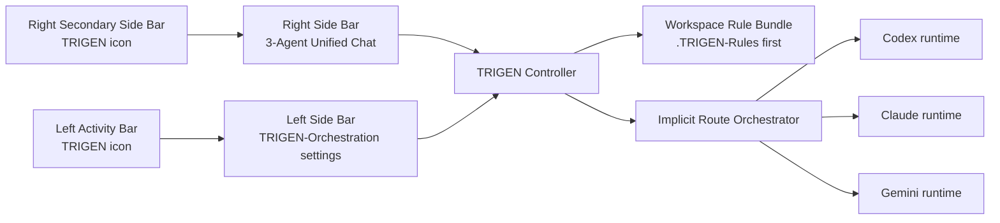

# Architecture / アーキテクチャ

TRIGEN-Orchestrationは、VS Code内でCodex、Claude、Geminiを1つの統合チャットに集約する拡張機能です。
TRIGEN-Orchestration is a VS Code extension that gathers Codex, Claude, and Gemini into one unified chat surface.

## Workbench Layout / 画面配置

左カラムは設定専用です。右カラムは3エージェント統合チャット専用です。中央エディタ領域にはTRIGENチャットを出しません。
The left column is only for settings. The right column is only for the 3-agent unified chat. TRIGEN chat does not open in the central editor.

## Core Flow / 基本フロー

1. ユーザーが右カラムの統合チャットへ依頼を書きます。
   The user enters a request in the right-column unified chat.
2. TRIGENは`.TRIGEN-Rules`を最優先に、ワークスペースルールを読み込みます。
   TRIGEN loads workspace rules with `.TRIGEN-Rules` first.
3. TRIGENはアクティブファイル、選択範囲、git statusを軽量スナップショットとして取得します。
   TRIGEN captures active file, selected text, and git status as a lightweight snapshot.
4. TRIGENはチャット文脈から内部実行経路を判定します。
   TRIGEN infers an internal execution route from chat context.
5. TRIGENはプロバイダー別プロンプトを作り、Codex、Claude、Geminiの実行面へ渡します。
   TRIGEN builds provider-specific prompts and sends them to Codex, Claude, and Gemini runtimes.
6. 結果は統合チャットに集約され、出力チャンネルにも記録されます。
   Results are gathered into the unified chat and written to the output channel.

## Internal Routes / 内部経路

TRIGENには次の実行経路がありますが、UI上の明示モードボタンはありません。
TRIGEN has the following routes, but the UI does not expose explicit mode buttons.

- `parallel`: 複数エージェントへ同時送信。
  Send to multiple agents at the same time.
- `serial`: 前のエージェント出力を次へ渡す。
  Feed each agent output into the next agent.
- `group`: 単一ラウンドのグループ相談。
  Run one group discussion round.
- `handoff`: 自律的な引き継ぎチェーン。
  Run an autonomous handoff chain.

## Modules / モジュール

- `src/extension.ts`: VS Code起動、ビュー登録、コントローラー、アカウント連携状態、設定保存。
  VS Code activation, view registration, controller, account link state, and settings persistence.
- `src/ui/controlCenter.ts`: 左設定ビューと右統合チャットビューのWebview実装。
  Webview implementation for the left settings view and right unified chat view.
- `src/core/providers.ts`: プロバイダー定義、公式拡張検出、CLI検出、実行。
  Provider definitions, official extension detection, CLI detection, and execution.
- `src/core/rules.ts`: `.TRIGEN-Rules`を先頭にしたルール読み込み。
  Rule loading with `.TRIGEN-Rules` first.
- `src/core/orchestrator.ts`: 暗黙モード判定と直列/並列/グループ/ハンドオフ実行。
  Implicit mode inference and serial/parallel/group/handoff execution.

## Context Bundle / コンテキスト束

TRIGENが各プロバイダーへ渡す文脈は監査可能な文字列です。
The context bundle sent to each provider is an auditable text bundle.

- ユーザー依頼 / User request
- 統合チャット方針 / Unified chat policy
- エージェント設定 / Agent runtime settings
- `.TRIGEN-Rules`を含むワークスペースルール / Workspace rules including `.TRIGEN-Rules`
- アクティブファイル、選択テキスト、git status / Active file, selected text, and git status
- 直列/ハンドオフ時の先行出力 / Prior output for serial or handoff routes

Prompt artifacts are written under `.trigen/prompts/` when enabled.
